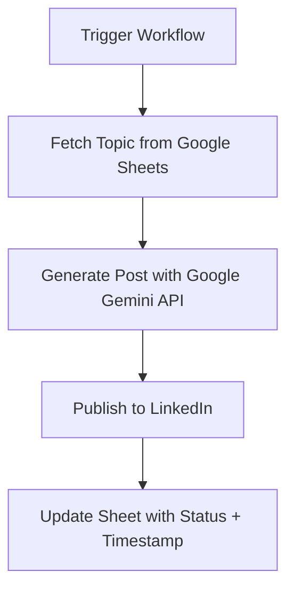

Got it 👍
Here’s a polished **README-style version** of your *Automated LinkedIn Content Publisher with n8n* — formatted for clarity, readability, and with some **eye-catching code blocks, tables, and highlights**:

---

# 🤖 Automated LinkedIn Content Publisher with n8n

This project provides a powerful **n8n workflow** that automates the entire process of creating and publishing content on LinkedIn.

It uses **Google Sheets** as a content queue, leverages the **Google Gemini API** to intelligently generate post copy, publishes it to your LinkedIn profile, and updates the sheet to track your posts.

---

## ✨ Features

* 📑 **Dynamic Content Queue** → Fetches post topics directly from a Google Sheet.
* 🧠 **AI-Powered Content Generation** → Uses Google Gemini API to generate insightful, human-like LinkedIn posts.
* 🚀 **Automated Publishing** → Posts directly to your LinkedIn profile.
* 📊 **Status Tracking** → Updates Google Sheets with status + timestamp to prevent duplicates.
* ⚡ **Scalable & Customizable** → Modify the AI prompt, add more nodes, or schedule automation.

---

## ⚙️ How It Works

The workflow follows a **5-step process**:



---

## 📋 Prerequisites

Before you begin, ensure you have:

* ✅ A running **n8n instance** (self-hosted or [n8n.cloud](https://n8n.io)).
* ✅ A **Google Account** with access to Sheets.
* ✅ A **Google Gemini API Key** (from [Google AI Studio](https://aistudio.google.com/)).
* ✅ A **LinkedIn Account**.

---

## 🚀 Setup Instructions

### **Step 1: Set Up Your Google Sheet**

Create a new Google Sheet with the following columns:

| Topic                        | Status     | Posted At |
| ---------------------------- | ---------- | --------- |
| The future of Web Dev        | Not Posted |           |
| My favorite VSCode extension | Not Posted |           |
| Why I use n8n for automation | Posted     | 9/20/2025 |

👉 Ensure column names are **exactly**:

```
Topic | Status | Posted At
```

---

### **Step 2: Import the n8n Workflow**

1. Download **`My workflow 4.json`**.
2. In n8n, click **Import from File** → select the JSON file.

---

### **Step 3: Configure Node Credentials**

* **Google Sheets Node (Get rows / Update row):**

  * Authenticate with Google (OAuth2).

* **Google Gemini Chat Model Node:**

  * Create **Google PaLM API** credential.
  * Paste your Gemini API key.

* **LinkedIn Node (Create a post):**

  * Authenticate with LinkedIn (OAuth2).

---

### **Step 4: Configure Node Parameters**

* **Get row(s) in sheet:**

  ```yaml
  Document ID: <your Google Sheet>
  Sheet Name: <your sheet name>
  Filter: Status == "Not Posted"
  ```

* **Update row in sheet:**

  ```yaml
  Matching Column: Topic
  Update: 
    Status: "Posted"
    Posted At: {{ $now }}
  ```

---

## 🏃 Usage

1. Add new ideas to your Google Sheet with `Status = Not Posted`.
2. Open n8n → **Execute Workflow**.
3. Watch your post get **auto-generated, published, and tracked** 🎉

---

## 💡 Pro Tip

To make it fully **hands-free**, replace the manual trigger with a **Cron node**:

```yaml
Cron:
  Mode: Every Day
  Time: 9:00 AM
```

Now your posts will be published automatically on schedule 🚀

---

👉 Would you like me to also make a **clean copy-paste Markdown README.md file** version of this so you can directly drop it into GitHub?
