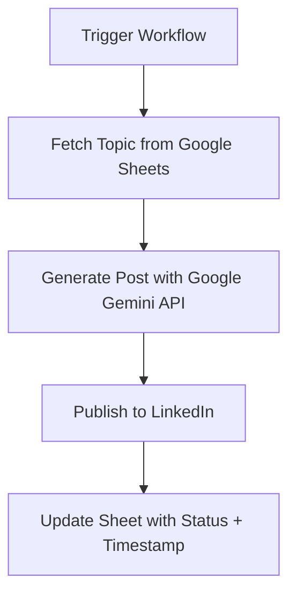

Perfect! I’ve updated the README to reflect your renamed workflow file **`linkedin_n8n.json`** and polished it for clarity. Here’s the revised version:

---

# Automated LinkedIn Content Publisher with n8n

Automate your **LinkedIn content publishing** using n8n! This workflow fetches topics from **Google Sheets**, generates posts via **Google Gemini API**, publishes to LinkedIn, and updates your sheet automatically.

---

## ✨ Features

* 📑 **Dynamic Content Queue:** Fetch topics directly from Google Sheets.
* 🧠 **AI-Powered Content Generation:** Uses Google Gemini API for human-like LinkedIn posts.
* 🚀 **Automated Publishing:** Posts directly to your LinkedIn profile.
* 📊 **Status Tracking:** Updates Google Sheets with status + timestamp.
* ⚡ **Scalable & Customizable:** Easily modify prompts, nodes, or schedule execution.

---

## ⚙️ How It Works

The workflow logic:



---

## 📋 Prerequisites

Before you begin:

1. **n8n instance** (self-hosted or cloud)

   * **Reason to use Docker:** Installing n8n locally can be error-prone due to Node.js version conflicts and dependencies. Docker provides a **consistent, isolated environment** for n8n to run reliably on any system.

2. **Docker Installation**

   * Install Docker from [https://www.docker.com/get-started](https://www.docker.com/get-started)
   * Verify installation:

     ```bash
     docker --version
     ```

3. **Google Account with API Access**

   * Enable the following APIs in your Google Cloud project:

     * **Google Drive API** → allows n8n to access your Sheets
     * **Google Sheets API** → allows reading/writing your content queue
   * Create OAuth credentials for n8n

4. **Google Gemini API Key**

   * Get your key from [Google AI Studio](https://aistudio.google.com/)
   * Used for generating AI-written LinkedIn content

5. **LinkedIn Account**

---

## 🚀 Setup Instructions

### **Step 1: Set Up Your Google Sheet**

Create a sheet with these columns:

| Topic                        | Status     | Posted At |
| ---------------------------- | ---------- | --------- |
| The future of Web Dev        | Not Posted |           |
| My favorite VSCode extension | Not Posted |           |
| Why I use n8n for automation | Posted     | 9/20/2025 |

* Column names must be **exactly**: `Topic | Status | Posted At`

---

### **Step 2: Import the n8n Workflow**

1. Download **`linkedin_n8n.json`**
2. In n8n, click **Import from File** → select the JSON file

---

### **Step 3: Configure Node Credentials**

* **Google Sheets Node (Get rows / Update row):**

  * Authenticate with Google OAuth2

* **Google Gemini Chat Model Node:**

  * Create **Google PaLM API** credential → paste Gemini API key

* **LinkedIn Node (Create a post):**

  * Authenticate with LinkedIn OAuth2

---

### **Step 4: Configure Node Parameters**

* **Get row(s) in sheet:**

```yaml
Document ID: <your Google Sheet>
Sheet Name: <your sheet name>
Filter: Status == "Not Posted"
```

* **Update row in sheet:**

```yaml
Matching Column: Topic
Update: 
  Status: "Posted"
  Posted At: {{ $now }}
```

---

## 🏃 Usage

1. Add new post ideas to your Google Sheet with `Status = Not Posted`.
2. Open n8n → **Execute Workflow**.
3. Watch as your post gets **written, published, and tracked automatically** 🎉

---

## 💡 Pro Tip

Replace manual trigger with a **Cron node** for fully automated posting:

```yaml
Cron:
  Mode: Every Day
  Time: 9:00 AM
```
Following this video will help you integrate your Google Sheets API with n8n, allowing the workflow to read/write your content queue seamlessly.

📺 Video Guide: Google Sheets API Setup

For beginners who are new to Google Cloud APIs, this video shows:

- How to enable Google Sheets API
- How to create OAuth 2.0 credentials
- Where to find your Client ID and Client Secret
- How to connect your Google account with n8n

🎥 Watch here: Google Sheets API Setup Guide

[](https://www.youtube.com/watch?v=CdssoZAslq0)

---

## ⚠️ Notes

* Docker ensures **consistent environment** for n8n → avoids dependency issues.
* Gemini API handles **AI content generation**, so make sure your key is active and has access.
* Google Drive & Sheets API must be **enabled** in your Google Cloud project, otherwise workflow nodes won’t connect.
